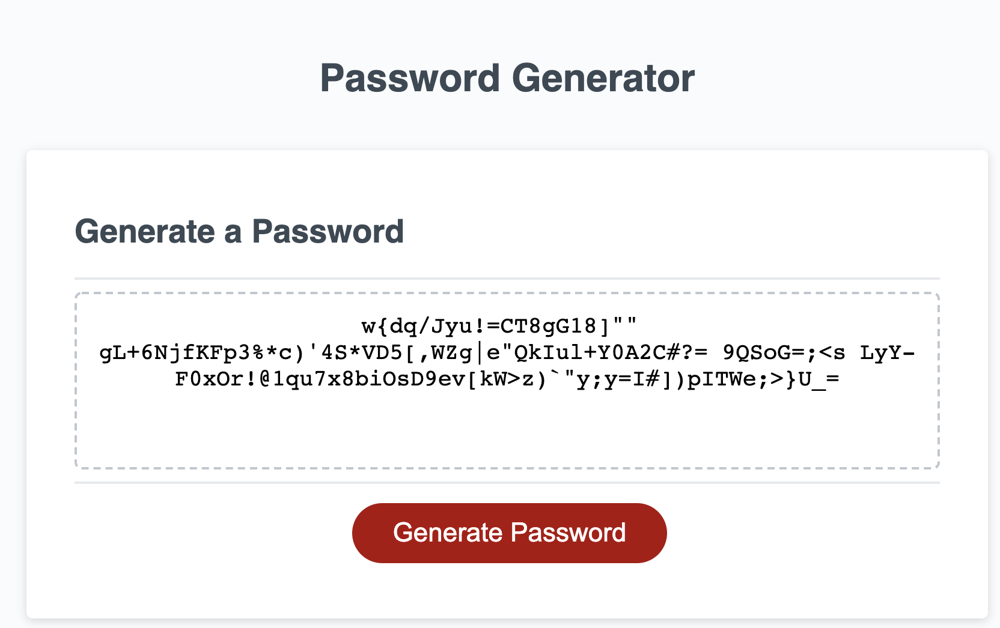
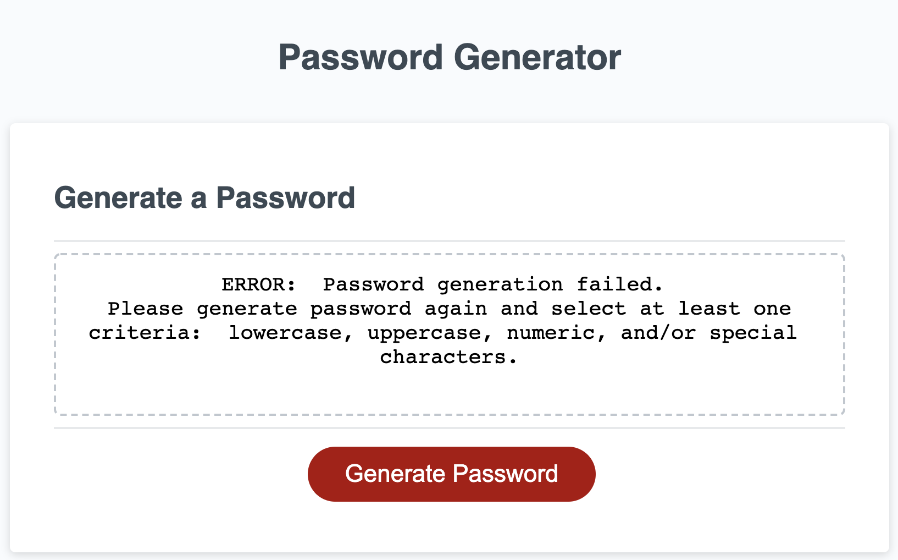

# HW3 JavaScript: Password Generator

## The Application

I created an application that an employee can use to generate a random password based on criteria they’ve selected by modifying starter code. This app will run in the browser, and will feature dynamically updated HTML and CSS powered by JavaScript code that you write. It will have a clean and polished user interface that is responsive, ensuring that it adapts to multiple screen sizes.

## Features

This application will generate a password by prompting the user to choose the following: 
* Whether the password should include at least 1 lowercase character 
* Whether the password should include at least 1 uppercase character 
* Whether the password should include at least 1 numeric character 
* Whether the password should include at least 1 special character 
* Whether the password has a length of at least 8 characters and no more than 128 characters

## Error Handling

This application will show an error message for the following cases: 
* If the user has not selected any criteria for characters 
* If the user does not enter a number in for the length of password 
* If the user does not enter a number between 8 and 128 characters 

Note: For any floating numbers enterd into the prompt, the application will floor the number into an integer. 

## Learnings 

1. Using Javascript to code application
2. Create a unique random string of 4 integers

## Link to finished product website
[Link to finished product](https://alzcheng.github.io/passwordGenerator/)
